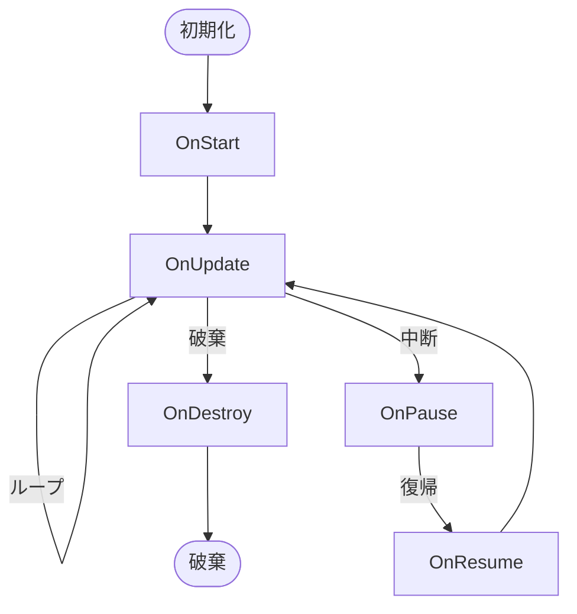

シーンには、起動した時、フレーム更新時、破棄される時などの特定のタイミングで呼び出されるメソッドがあります。
これらを **ライフサイクル メソッド** と呼びます。

一部のメソッドは既に以前の章で扱っているので、この章では、より詳細な説明を、シーン自体のライフサイクルと共に説明します。

## ライフサイクル図
Promete がシーンをどのように扱うかを示すライフサイクル図を以下に示します。

シーンを読み込み、破棄するまでのライフサイクルには、**初期化**、**ループ**、**破棄**、**中断**、**復帰**の5つの状態があります。

## 初期化

読み込まれたシーンの最初の状態は **初期化** です。

この状態では、シーンのコンストラクタおよび、シーンが読み込まれた直後に呼び出される `OnStart` メソッドが実行されます。

## ループ

初期化後、すぐに **ループ** 状態になります。

Prometeのゲームループの中で、現在有効なシーンの `OnUpdate` メソッドが毎フレーム呼び出されます。

## 破棄

他のシーンを読み込む、またはアプリケーションが終了するとき、シーンは **破棄** 状態になります。

この状態では、シーンの `OnDestroy` メソッドが呼び出され、その後は.NETのガベージ コレクターに収集されます。

## 中断
他のシーンがプッシュされたとき、シーンは **中断** 状態になります。

メモリから破棄されることはないため、クラスのインスタンス メンバーは保持されますが、`OnUpdate` は呼び出されません。

## 復帰
シーンがポップされたとき、以前のシーンが **復帰** 状態になります。

直後に `OnResume` メソッドが呼び出され、その後は **ループ** 状態に戻ります。

## シーン スタック
Prometeは、現在読み込まれているシーンとは別に、以前読み込まれていたシーンを **シーン スタック** に保持できます。

シーン スタックは、シーンの **プッシュ** と **ポップ** によって操作されます。

### プッシュ
プッシュは、現在のシーンをシーン スタックに送る操作です。

シーンをプッシュすると、現在のシーンは **中断** 状態になり、新しいシーンを読み込みます。

### ポップ
ポップは、シーン スタックからシーンを取り出す操作です。

シーンをポップすると、現在のシーンは **破棄** 状態になり、以前のシーンが **復帰** 状態になります。
これにより、以前のシーンが現在のシーンになります。
